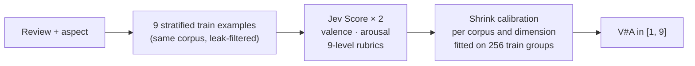
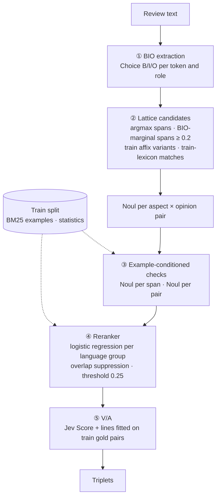

<div align="center">

# Jev × DimABSA

**Dimensional aspect-based sentiment analysis with a classification-only model: no text generation, no fine-tuning, no GPU.**

[TypeSafe Jev](https://typesafe.ai) (System One) on [SemEval-2026 Task 3 · DimABSA](https://github.com/DimABSA/DimABSA2026), Track A

[](https://github.com/DimABSA/DimABSA2026)
[](https://docs.typesafe.ai/introduction)
[](#quick-start)
[](#quick-start)
[](#quick-start)

[Results](#results-at-a-glance) · [Task 1](#task-1--dimasr-valencearousal-of-a-given-aspect) · [Task 2](#task-2--dimaste-aspectopinionva-triplets) · [Quick start](#quick-start) · [Layout](#repository-layout) · [Experiment logs](logs/README.md) · [Data](#dataset)

</div>

---

DimABSA replaces sentiment polarity with continuous **valence and arousal on a 1–9 scale**. Jev
has no text-generation interface: it answers typed questions about a state. Its
[`Score`](https://docs.typesafe.ai/primitives/score) returns a probability-weighted position on a
described scale, while `Choice` and `Noul` return probabilities over options and yes/no. Every
system here is built from those three primitives, a few train-split statistics and the
unchanged official scorer.

## Results at a glance

<table>
<tr>
<th width="50%">Task 1 · DimASR — score a given aspect</th>
<th width="50%">Task 2 · DimASTE — extract aspect–opinion–VA triplets</th>
</tr>
<tr>
<td align="center">
<h3>1.1199 RMSE<sub>VA</sub></h3>
official test, 10 corpora, lower is better<br>
<b>behind only PAI and TeleAI among the 14 teams with all ten corpora</b><br>
(PAI ≈ 1.066 · TeleAI ≈ 1.074, reconstructed micro aggregates)
</td>
<td align="center">
<h3>51.68 cF1</h3>
official test, 8 corpora, macro, higher is better<br>
<b>between 6th and 7th of the 12 teams with all eight corpora</b><br>
(PAI 57.73 leads · within 2 points of the per-corpus winners on English)
</td>
</tr>
</table>

Both numbers come from a single frozen run on the official test split, after all choices
were made on train and dev. Full protocols are in [`logs/`](logs/README.md).

## Task 1 · DimASR: valence/arousal of a given aspect

Given a review and one of its aspects, predict `V#A`.



- **Rubrics.** Each dimension is a 9-level scale whose levels describe the emotional content,
  not the writing style ([`jev/rubrics.py`](jev/rubrics.py)); `Score` returns the
  probability-weighted level, mapped linearly to 1–9.
- **Examples.** Nine train records per corpus, the earliest in each equal-width valence band
  (topped up in file order where a band is empty), frozen for the whole run and never re-picked
  ([`jev/fewshot.py`](jev/fewshot.py)).
- **Calibration.** `mean_gold + α · (raw − mean_raw)` per corpus and dimension, α chosen by
  grouped 5-fold CV on train; the method family was selected on dev and frozen before test
  ([`tools/calibrate_st1.py`](tools/calibrate_st1.py), log [0005](logs/0005-st1-supervised-calibration.md)).

<details>
<summary><b>Task 1 results</b>: official test, micro RMSE<sub>VA</sub> over 16,186 gold entries</summary>

<br>

Official scorer, `--do_norm` off. `RMSE_VA = √(mean(ΔV² + ΔA²))` in scale units; 0 is perfect.

| System | RMSE<sub>VA</sub> ↓ |
|---|---:|
| [PAI](https://aclanthology.org/2026.semeval-1.193/), Qwen3-32B LoRA + Sinkhorn adaptation † | ≈ 1.0663 |
| [TeleAI](https://aclanthology.org/2026.semeval-1.233/), Qwen2.5-7B LoRA regression + calibration † | ≈ 1.0737 |
| **Jev, 9-shot + shrink calibration** | **1.1199** |
| PALI | ≈ 1.1340 |
| HUS@NLP-VNU † | ≈ 1.1368 |
| **Jev, zero-shot + shrink calibration** | **1.1395** |
| Habib University | ≈ 1.1467 |
| [ICT-NLP](https://aclanthology.org/2026.semeval-1.131/), multilingual XLM-R large ensemble † | ≈ 1.1592 |
| GPT-OSS-120B, fine-tuned | ≈ 1.2362 |
| Kimi-K2, one-shot | ≈ 1.8873 |
| Jev, 9-shot, valence-stratified | 2.0736 |
| GPT-5 mini, one-shot | ≈ 2.1552 |
| Jev, 3-shot | 2.1721 |
| Qwen3-14B, QLoRA fine-tuned | ≈ 2.1841 |
| Kimi-K2, zero-shot | ≈ 2.3849 |
| Jev, zero-shot | 2.4708 |
| GPT-5 mini, zero-shot | ≈ 2.7439 |

Participant rows are every team with results on all ten corpora down to ICT-NLP; the other
eight such teams are above 1.16. † Official per-dataset winners
(PAI: Russian, Tatar, Ukrainian; TeleAI: both Japanese corpora and Chinese laptop; ICT-NLP:
Chinese restaurant; HUS@NLP-VNU: Chinese finance). LogSigma won both English corpora but
reported only those two. Participant aggregates are reconstructed from the
[official overview](https://aclanthology.org/2026.semeval-1.452/), Table 6, as
`√(Σ N_c · RMSE_c² / Σ N_c)`; the competition ranks each corpus, not this aggregate. Baseline
aggregates are reconstructed the same way from [arXiv:2601.23022](https://arxiv.org/abs/2601.23022),
Table 3. Per-corpus comparison:
[`docs/sota-comparison-2026-09-23.md`](docs/sota-comparison-2026-09-23.md).

</details>

## Task 2 · DimASTE: aspect–opinion–VA triplets

Given only the review, output every `(Aspect, Opinion, V#A)`. A pair scores only if both
strings match the annotation exactly, so span boundaries decide most of the metric.



1. **BIO extraction** ([`jev/extraction.py`](jev/extraction.py)). Deterministic tokens (CJK
   characters, other words); one `Choice` over B/I/O per token and role.
2. **Lattice candidates** ([`jev/lattice.py`](jev/lattice.py)). Instead of one boundary per
   span, keep every span the per-token probabilities support, its train edge-affix variant
   ([`jev/spans.py`](jev/spans.py)) and literal train-vocabulary matches, then ask one `Noul`
   per aspect × opinion pair. Candidate coverage on dev rises from 57% to 78% of gold pairs.
3. **Checks with real examples** ([`jev/checks.py`](jev/checks.py),
   [`jev/retrieval.py`](jev/retrieval.py)). Four BM25-retrieved train reviews with their
   annotated phrases show Jev the dataset's boundary conventions; it judges each candidate
   span and each likely pair against them. This is the strongest single signal (AUC 0.80–0.90).
4. **Reranker** ([`jev/rerank.py`](jev/rerank.py)). A logistic regression per language group
   combines the Jev answers with train statistics (edge-affix log-odds, annotation counts,
   lengths, competing variants). Pairs are kept in score order, dropping any that overlap a
   kept pair on both roles. Fitted on dev and frozen: [`reports/task2/reranker.json`](reports/task2/reranker.json).
5. **V/A** uses the Task 1 questions on each kept pair, then one line per corpus and dimension
   fitted on Task 2 train gold pairs ([`reports/task2/va_calibration.json`](reports/task2/va_calibration.json)).

| System (official test, macro over 8 corpora) | cF1 ↑ |
|---|---:|
| PAI † | 57.73 |
| PALI † | 57.50 |
| nchellwig † | 56.55 |
| Takoyaki † | 56.20 |
| TeleAI † | 55.66 |
| TeamLasse | 53.43 |
| **Jev, lattice candidates + checks + reranker** | **51.68** |
| kevinyu66 | 51.48 |
| AILS-NTUA | 50.16 |
| Habib University | 47.15 |
| Llama-3.3-70B, fine-tuned | 46.40 |
| GPT-OSS-120B, fine-tuned | 45.71 |
| Kimi-K2 Thinking, one-shot | 38.59 |
| Qwen3-14B, QLoRA fine-tuned | 28.75 |
| Jev, training lexicon + pair decisions ([0006](logs/0006-st2-lexicon-pair-baseline.md)) | 27.71 |

Participant rows are the teams with results on all eight corpora in the
[official overview](https://aclanthology.org/2026.semeval-1.452/), Table 7, down to Habib
University (macro computed here); the three others score below 42. The competition ranks each
corpus separately. † Per-corpus winners (Takoyaki: both English corpora; TeleAI: Japanese;
PAI: Russian, Ukrainian, Chinese restaurant; nchellwig: Tatar; PALI: Chinese laptop).
Baselines: [arXiv:2601.23022](https://arxiv.org/abs/2601.23022), Table 3.

<details>
<summary><b>Per-corpus Task 2 results</b>: test cF1, dev estimate, and the leading systems</summary>

<br>

| Corpus | Jev dev (5-fold CV) | **Jev test** | Best official (team) | PAI | PALI |
|---|---:|---:|---:|---:|---:|
| eng_restaurant | 76.35 | **68.76** | 70.21 (Takoyaki) | 69.03 | 69.28 |
| eng_laptop | 67.67 | **61.86** | 63.66 (Takoyaki) | 61.69 | 62.42 |
| zho_restaurant | 57.89 | **48.64** | 56.38 (PAI) | 56.38 | 56.34 |
| zho_laptop | 37.84 | **38.72** | 53.08 (PALI) | 53.06 | 53.08 |
| jpn_hotel | 53.58 | **49.43** | 58.37 (TeleAI) | 56.82 | 56.66 |
| rus_restaurant | 53.75 | **50.75** | 57.93 (PAI) | 57.93 | 57.24 |
| tat_restaurant | 51.59 | **46.44** | 51.19 (nchellwig) | 49.08 | 48.28 |
| ukr_restaurant | 53.03 | **48.87** | 57.87 (PAI) | 57.87 | 56.71 |
| **Macro** | **56.46** | **51.68** | — | 57.73 | 57.50 |

With exact V/A the same pairs would score 56.12 on test; the remaining gap to the leading
systems is extraction, above all Chinese laptop, where only about 62% of gold pairs reach the candidate
set. Protocol, costs and caveats: log [0007](logs/0007-st2-lattice-reranker.md).

</details>

## Quick start

```bash
uv venv .venv && uv pip install --python .venv/bin/python numpy scipy
export TYPESAFE_API_KEY=...        # the client also reads ~/.zshrc
# Data: see "Dataset" below; the code expects vendor/DimABSA2026/
```

<details open>
<summary><b>Task 1</b>: 9-shot + shrink calibration</summary>

```bash
# fit calibration on train, select on dev, save parameters
.venv/bin/python tools/calibrate_st1.py dev  --out reports/calibration_reproduction
# apply the frozen calibration to test and score
.venv/bin/python tools/calibrate_st1.py test --out reports/calibration_reproduction
cat reports/calibration_reproduction/test_summary.json

# raw inference for one corpus (or --corpus all)
.venv/bin/python runners/run.py --task 1 --corpus eng_restaurant --split test \
  --shots 3 --out reports/st1_reproduction --concurrency 5
```

</details>

<details open>
<summary><b>Task 2</b>: lattice candidates + checks + reranker</summary>

```bash
# 0. lexicon baseline per split; its pair answers are reranker features
.venv/bin/python runners/run.py --task 2 --split dev  --out reports/st2_baseline_20260923
.venv/bin/python runners/run.py --task 2 --split test --out reports/st2_baseline_20260923
# 1. V/A lines from train gold pairs
.venv/bin/python tools/run_task2.py va
# 2. dev: all Jev signals, 5-fold CV score, fit and save the reranker
.venv/bin/python tools/run_task2.py dev
# 3. test: signals, frozen reranker, official scorer
.venv/bin/python tools/run_task2.py test
```

Every request and per-record stage is cached, so interrupted runs resume and `--cache-only`
replays a finished run without API calls. A full test run is about 130M input tokens (≈ $5.4).

</details>

Both tasks pin `jev-1.13.0`; the dataset and scorer snapshot is pinned in
[`data-version.json`](data-version.json). API keys come from the
[TypeSafe console](https://console.typesafe.ai/); request shapes are documented at
<https://docs.typesafe.ai/introduction>.

## Repository layout

```
jev/
  client.py       Jev HTTP client: retries, never logs the key
  rubrics.py      9-level valence/arousal scales and question wording
  fewshot.py      Task 1 example selection and leak filtering
  data.py         jsonl loading, prediction de-duplication
  triplets.py     Task 2 training-lexicon candidates and pair decisions
  extraction.py   Task 2 ① per-token BIO Choice + Noul pair decisions
  spans.py        Task 2 train statistics: NULL policy, edge affixes
  lattice.py      Task 2 ② lattice candidates, Noul per pair
  retrieval.py    Task 2 BM25 train examples
  checks.py       Task 2 ③ example-conditioned span and pair checks
  rerank.py       Task 2 ④ features, per-group logistic reranker, selection
  task2.py        Task 2 request cache, pair V/A ⑤, official cF1
runners/          unified --task 1|2 inference, concurrency, resume, usage accounting
tools/
  calibrate_st1.py   Task 1 train calibration, dev selection, frozen test
  run_task2.py       Task 2 pipeline: va | dev | test
  leakage_audit.py   train/dev/test overlap report
  analyze_st1_design.py, probe_fewshot.py   Task 1 official-score checks and delivery probes
scoring/score.py  wraps the official metrics script, unmodified
logs/             one record per finalized experiment
reports/          metrics summaries and frozen parameters (no dataset text)
```

**Branches.** `main` holds the current best systems and their frozen results. The `dev` branch
keeps the full development history: every dev iteration record (`deving/`), retired
extractors and exploratory reports.

## Dataset

The data belongs to the DimABSA organizers and is **not redistributed here**. From the
competition rules:

> - Datasets should only be used for scientific or research purposes.
> - Any other use is explicitly prohibited.
> - Datasets must not be redistributed or shared with third parties.
> - Interested parties should be directed to the official website.

Fetch the [pinned official snapshot](https://github.com/DimABSA/DimABSA2026/tree/bdc93be1224106ae7d3eb95739c02a76ed4ae8a1/task-dataset)
into `vendor/DimABSA2026/` (ignored by Git):

```bash
git clone https://github.com/DimABSA/DimABSA2026.git vendor/DimABSA2026
git -C vendor/DimABSA2026 checkout bdc93be1224106ae7d3eb95739c02a76ed4ae8a1
```

Anything that embeds dataset text (predictions, requests, responses) stays in ignored
`reports/**/cache/` directories and prediction files; committed reports hold metrics only.

Papers: [arXiv:2601.23022](https://arxiv.org/abs/2601.23022) (Track A dataset) ·
[arXiv:2601.21483](https://arxiv.org/abs/2601.21483) (Track B) ·
[arXiv:2604.07066](https://arxiv.org/abs/2604.07066) (task overview)

## Known limits

- **Jev is not deterministic.** Identical calls differ by about 0.04 per V/A dimension, so single
  runs carry that noise.
- **Dev is optimistic for Task 2.** The reranker is trained on dev and its threshold and features
  were chosen there; test came in 4.8 points below the cross-validated dev estimate.
- **Sentence reuse across splits.** IDs are disjoint but some text is not (`jpn_hotel` repeats
  23 train sentences in test). Example selection and retrieval drop any train record whose
  normalised text occurs in the evaluated split ([`tools/leakage_audit.py`](tools/leakage_audit.py)).
- **Coverage.** Task 2 does not output NULL opinions, proposes NULL aspects only for Japanese,
  and cannot recover spans that no candidate source proposes. Subtask 3 is not implemented.
